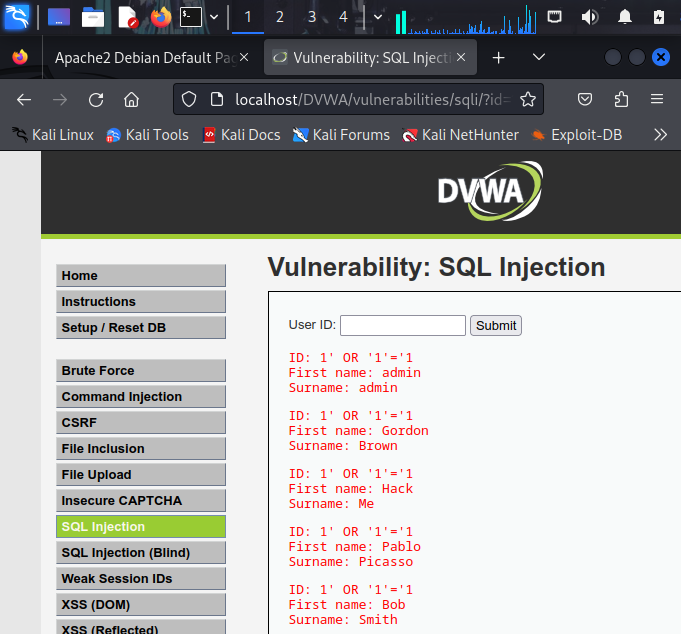
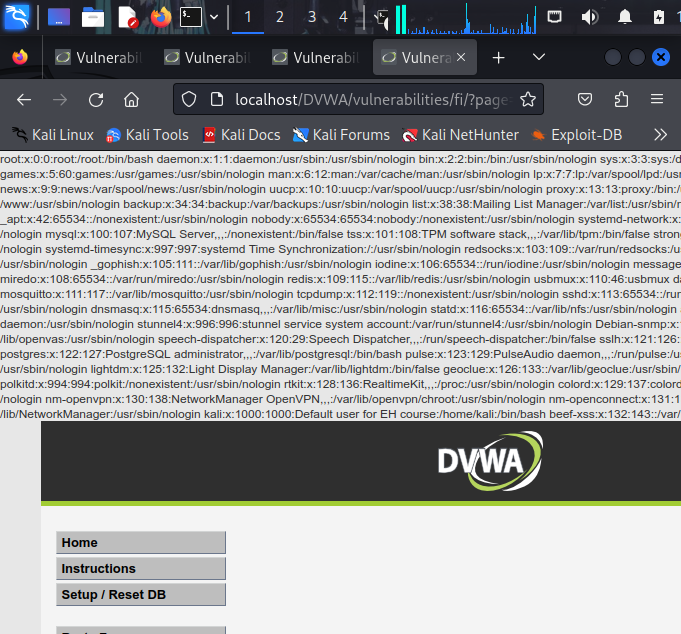

# DVWA Security Lab (Kali Linux)

## Overview
This project demonstrates exploitation of common web vulnerabilities using Damn Vulnerable Web Application (DVWA).

## Environment
- OS: Kali Linux VM
- Application: DVWA
- IP Address: 10.0.2.15

---

## SQL Injection (Easy)

### Payload Used
' OR '1'='1

### Result
- Retrieved multiple user records from the database

### Impact
- Authentication bypass
- Unauthorized data access

---

## File Inclusion (LFI)

### Payload Used
../../../../etc/passwd

### Result
- Accessed sensitive system file

### Impact
- Exposure of system files
- Potential for further exploitation

---

## Tools Used
- Kali Linux
- DVWA
- Firefox Browser

---

## Lessons Learned
- Input validation is critical in web applications
- Improper file handling leads to serious vulnerabilities
- Security misconfigurations can expose sensitive data

---

## Author
alvine evander
